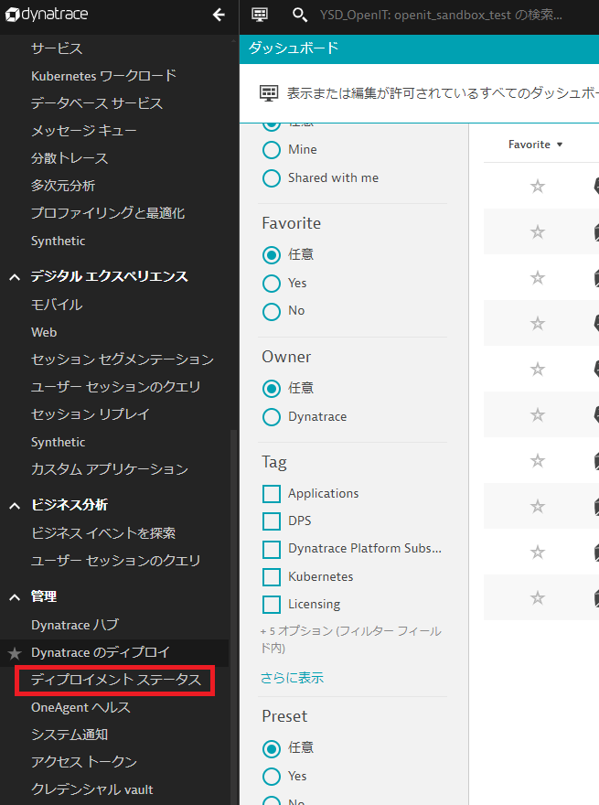
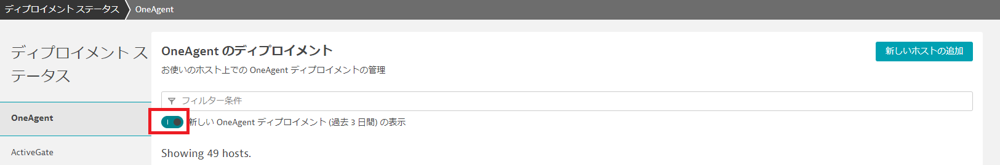
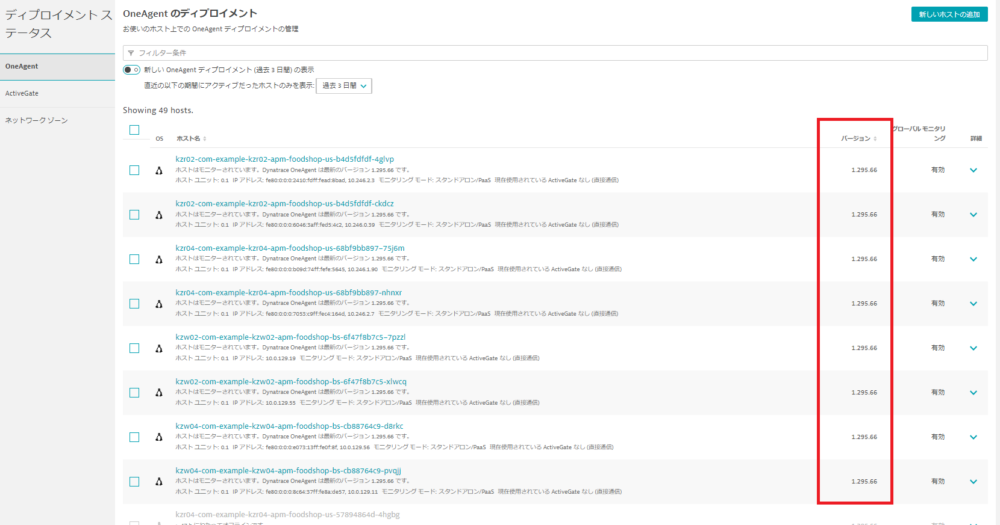

# DynatraceAgentバージョン確認手順

**目次**
- [DynatraceAgentバージョン確認手順](#dynatraceagentバージョン確認手順)
  - [1. ドキュメントの概要](#1-ドキュメントの概要)
  - [2. 前提条件](#2-前提条件)
  - [3. DynatraceAgentバージョン確認手順](#3-dynatraceagentバージョン確認手順)
    - [3.1. OneAgentのバージョン確認手順](#31-oneagentのバージョン確認手順)
    - [3.2. 後続手順](#32-後続手順)

## 1. ドキュメントの概要
- 本手順はDatadog検証前に実施する。
- DynatraceのOneAgentの現バージョンを確認する手順であり、検証を行う前にバージョンを確認する必要がある。
- DatadogのAPM導入後にDatadog側に問題がありDynatraceへ切り戻しを行う場合、元のDynatraceのバージョンに切り戻す必要がある。  
ただ、現Dynatraceの運用ではバージョン固定がされていないことからバージョンの固定化作業を事前に行う。  
バージョン固定化作業はインフラチームで行うが、現在運用しているDynatraceのAgentのバージョンを確認する必要がある。

## 2. 前提条件
- Dynatraceにアクセスできること。

## 3. DynatraceAgentバージョン確認手順

### 3.1. OneAgentのバージョン確認手順

1. Dynatraceの管理のディプロイメントステータスを選択する。  
  
  
2. 新しいOneAgentディプロイメント（過去3日間）の表示のトグルをON→OFFにする。  
  

3. 最新のバージョンを確認する。バージョンを選択することでソートすることが可能。  
  

### 3.2. 後続手順

- 各ホストのDynatraceのOneAgentのバージョンをインフラチームに連携する。
- そのバージョンを基にインフラチームはDynatraceのOneAgentのバージョンを固定化する。  
固定化されるバージョンは、テナント（開発、本番）でバージョンが異なった場合、本番に合わせる。  
Pod毎にバージョンが異なる場合、最新に合わせるという方針とする。
- 切り戻しが発生した場合に固定化されたOneAgentのバージョンに戻すことができる。
