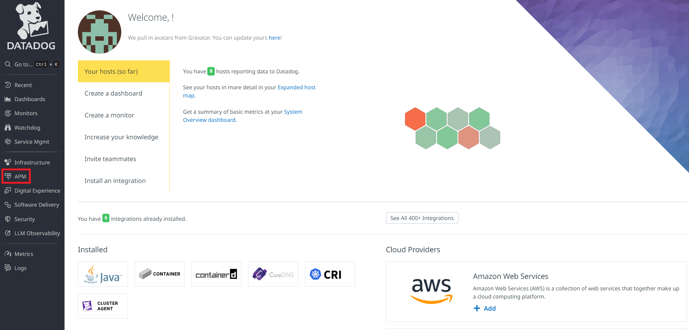
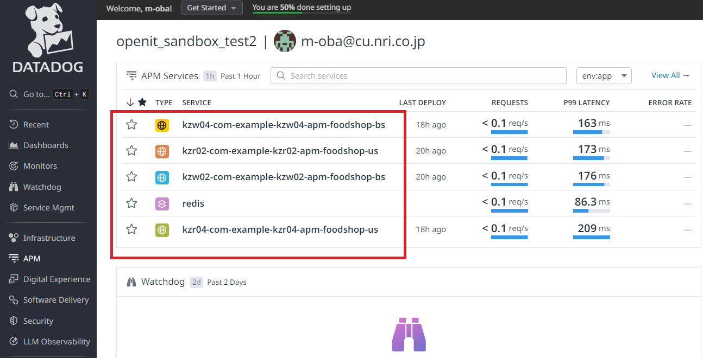
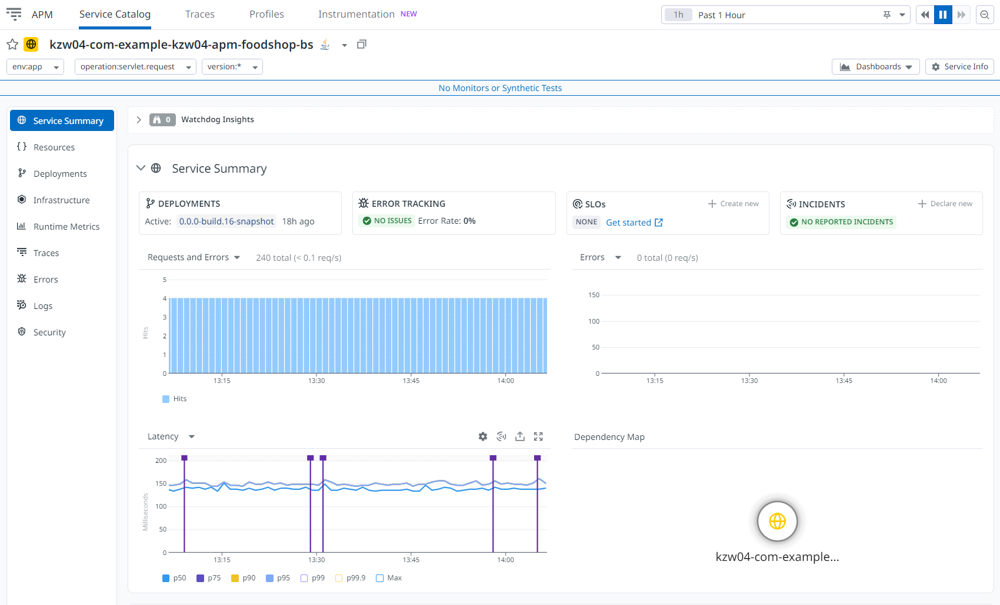
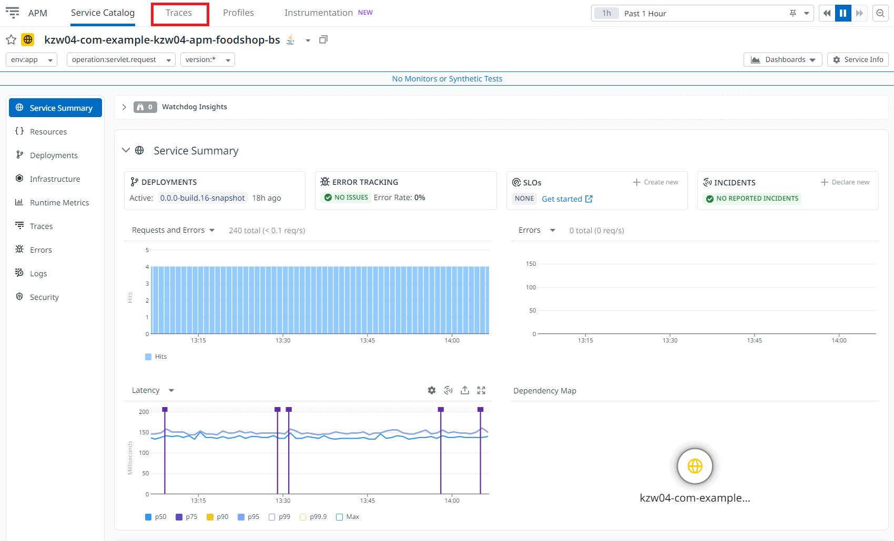
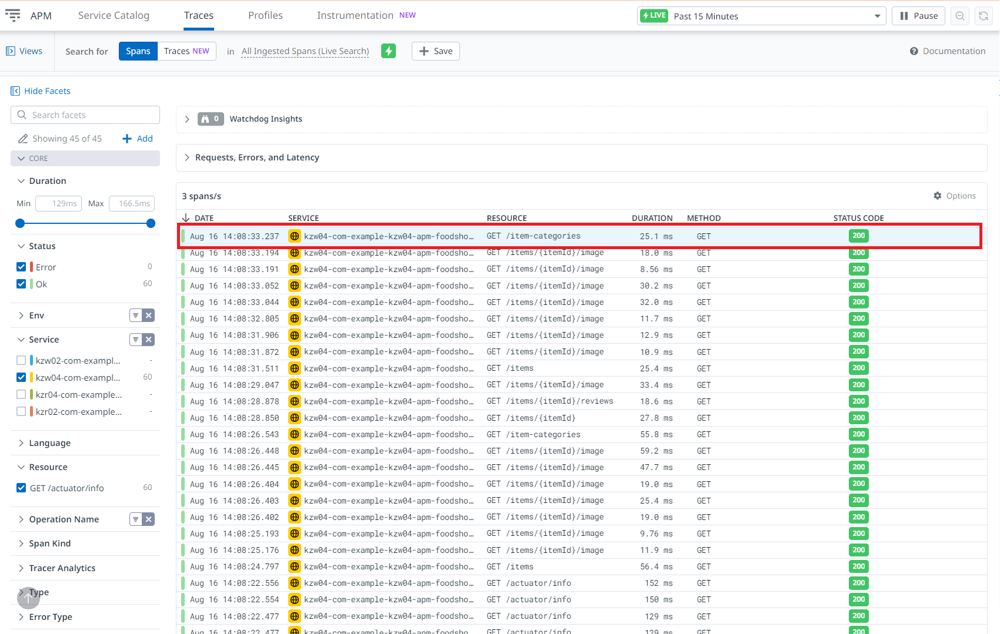
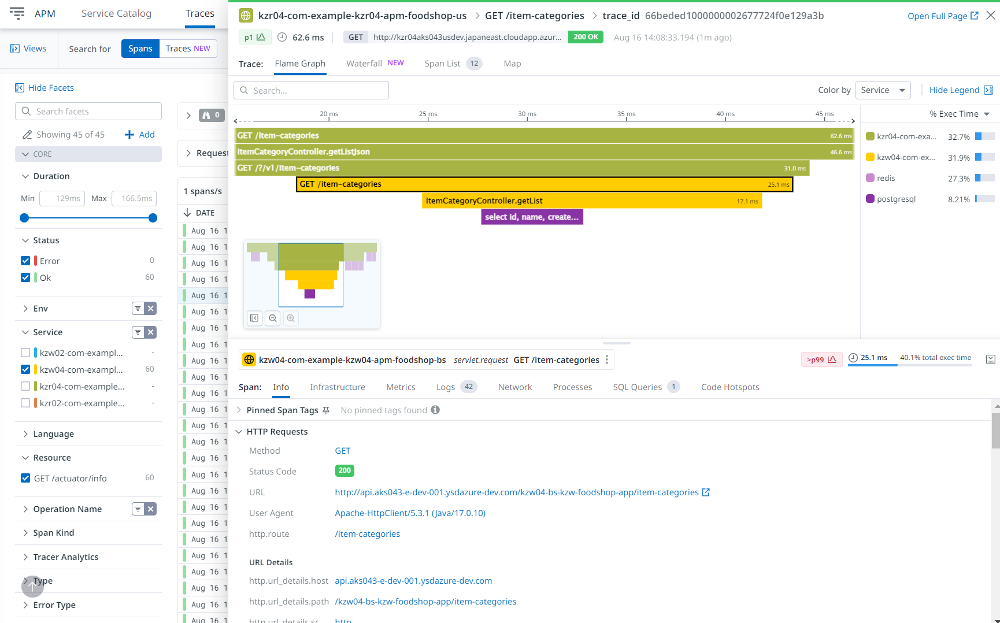

# Datadog動作確認手順

**目次**
- [Datadog動作確認手順](#datadog動作確認手順)
  - [1. ドキュメントの概要](#1-ドキュメントの概要)
  - [2. 前提条件](#2-前提条件)
  - [3. Datadog動作確認手順](#3-datadog動作確認手順)
    - [3.1. DatadogのAPM動作確認](#31-datadogのapm動作確認)
    - [3.2. Datadogの既存機能確認](#32-datadogの既存機能確認)
    - [3.3. 後続作業](#33-後続作業)

## 1. ドキュメントの概要
- DatadogのAPM機能が使えていることを確認する。
- Datadogの既存（infrastructure機能、Log機能）の機能が使えていることを確認する。

## 2. 前提条件
- DatadogのAPM設定を実施したあとにデプロイを実施すること。
- デプロイ方法は各案件の手順に従うこと。
- Datadogにアクセスできること。

## 3. Datadog動作確認手順

### 3.1. DatadogのAPM動作確認
1. Datadogのポータル画面を開き、APMを選択する。 
   
2. サービス名（デプロイメント名）が表示されていることを確認する。 
   
3. サービス名を選択し、そのサービスのメトリクスが表示されていることを確認する。 
   
4. Traceタグを選択する。 
   
5. リクエストを選択する。 
   
6. トレース情報を表示していることを確認する。 
   

### 3.2. Datadogの既存機能確認
- 現行の運用で使えている機能が問題ないことを確認する。
  - 例：ダッシュボード表示、業務ログの確認。

### 3.3. 後続作業
- Datadogに何か問題が生じた場合、Dynatrace側へ切り戻しを実施する。
- [Dynatrace切り戻し手順](./05.Dynatrace切り戻し手順.md)を参照。