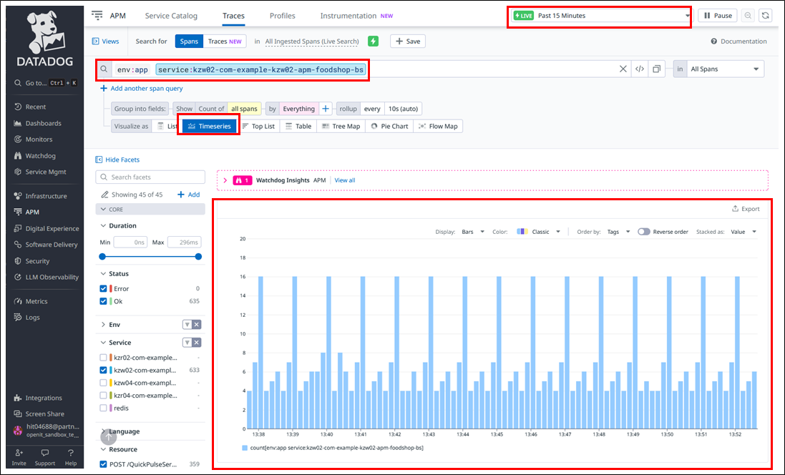

# トレース機能

**目次**
- [トレース機能](#トレース機能)
  - [1. ドキュメントの概要](#1-ドキュメントの概要)
  - [2. トレース機能](#2-トレース機能)
    - [2.1. トレースエクスプローラーへの遷移方法](#21-トレースエクスプローラーへの遷移方法)
    - [2.2. トレースエクスプローラー上の表示条件指定方法](#22-トレースエクスプローラー上の表示条件指定方法)
    - [2.3. トレースエクスプローラー上の表示切替方法](#23-トレースエクスプローラー上の表示切替方法)
    - [2.4. トレースビューの確認方法](#24-トレースビューの確認方法)

## 1. ドキュメントの概要
DataDogのトレース機能利用方法について記載する。  

## 2. トレース機能
DataDogのトレースエクスプローラーを利用することで各種アプリケーションへの接続状況をトレースできる。  
:bulb: 詳細は[トレースエクスプローラー](https://docs.datadoghq.com/ja/tracing/trace_explorer/?tab=%E3%83%AA%E3%82%B9%E3%83%88%E8%A1%A8%E7%A4%BA&site=ap1)を参照。

### 2.1. トレースエクスプローラーへの遷移方法

1. 左側ナビゲーションのAPM上へマウスポインタを移動。  
1. Traces の Explorerをクリック。  
    

### 2.2. トレースエクスプローラー上の表示条件指定方法
:bulb: 抽出条件として指定可能なラベルは[DatadogAPM設定手順](../01.Datadog導入資料/03.DatadogAPM設定手順.md)にて設定した下記の内容。  

|	ラベル名	|	内容	| 条件指定例	|
|	---	|	---	|	---	|
|	`tags.datadoghq.com/env` 	|	環境名	|	env: app	|
|	`tags.datadoghq.com/service`	|	deployment名	|	service: xxx	|
|	`tags.datadoghq.com/version`	|	バージョン	|	version: n.n.n	|

- 入力指定  
  1. 画面イメージ上部の表示時間範囲を指定。  
  1. 画面イメージ下部の表示対象を指定。  
      

- 選択指定  
  1. 画面イメージ左部の表示対象を指定することで検索条件を選択追加・除去することも可能。  
      

### 2.3. トレースエクスプローラー上の表示切替方法
表示条件指定の上、出力される情報は必要に応じた表示形式に切替が可能。  
以下は代表的な表示形式例。  

- リスト表示  
  「Visualize as」を「List」とすることで表示対象のアプリケーションへの接続状況がトレース可能。  
    

- 時系列表示  
  「Visualize as」を「Timeserie」とすることで表示対象のアプリケーションへの時系列接続状況がトレース可能。  
    

### 2.4. トレースビューの確認方法
トレースビューを利用することでトレース情報を詳細に確認することが可能。
詳細は[トレースビュー](https://docs.datadoghq.com/ja/tracing/trace_explorer/trace_view/?tab=%E3%83%95%E3%83%AC%E3%83%BC%E3%83%A0%E3%82%B0%E3%83%A9%E3%83%95)を参照。

1. トレースエクスプローラー上で確認対象を選定しクリック。  
1. 画面上にトレースビューが表示され、トレース個別の詳細情報の確認が可能。  
    
    
